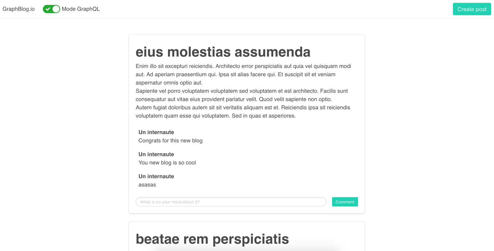
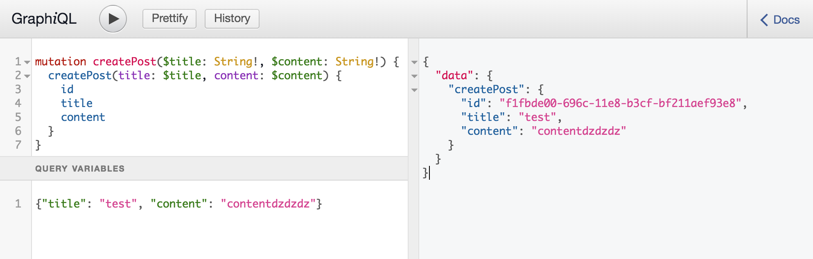

# GraphQL Workshop for Best Of Web


## Introduction

Ce workshop préparé au sein de [JS-Republic](http://js-republic.com/) par [Michael Romain](http://twitter.com/michaeldotjs) et [Mathieu Breton](https://twitter.com/matbreton) a pour but de vous apprendre à utiliser [GraphQL](https://graphql.org/).

D'une durée approximative de 3h, ce workshop vous guidera étape par étape dans la migration d'un blog basique fait avec une API REST vers une implémentation full GraphQL.
Chaque partie débutera par une courte présentation faite par l'animateur du workshop afin d'expliquer les points qui seront traités dans celle-ci, puis les candidats suivront l'énoncé pour accomplir la partie en question. Une fois l'étape terminée, l'animateur répondra aux questions et passera à la partie suivante.

Chaque étape vous démontrera les avantages (et inconvénients) de GraphQL comparé à REST pour les mêmes besoins. Ce workshop est conçu pour des développeurs JavaScript, débutants en GraphQL.

Pour commencer, assurez-vous d'avoir les pré-requis ci-dessous puis procéder à l'installation du projet de workshop. Une description du projet vous attends une fois l'installation terminée.

## Pré-requis

Pour suivre ce workshop, vous aurez besoin :

* De connaissances confirmées dans le langage [JavaScript](https://developer.mozilla.org/fr/docs/Web/JavaScript), en [NodeJS](https://nodejs.org/en/) et en développement Front-End.
* D'une prémière expérience avec les [API REST](https://openclassrooms.com/courses/utilisez-des-api-rest-dans-vos-projets-web).
* De [NodeJS](https://nodejs.org/en/) installé en version **6.14.2 et plus**. Dans un soucis de compatibilité, l'implémentation back-end fonctionne avec la version 6.\* de Node, version la plus vielle actuellement encore maintenue. Si vous utilisez [nvm](https://github.com/creationix/nvm), vous pouvez faire un `nvm use` à la racine du projet pour passer directement dans la bonne version de NodeJS.
* D'un éditeur de code. [Visual Studio Code](https://code.visualstudio.com/) fait désormais référence.

## Installation

Une fois n'est pas coutume, nous récupérons ce projet depuis Github et installerons ses dépendances :

```bash
git clone https://github.com/js-republic/graphql-workshop.git
cd graphql-workshop
npm install
```

Il ne reste plus qu'à le démarrer :

```bash
npm start
```

Votre navigateur s'ouvre à l'adresse <http://localhost:3000>, vous devriez découvrir cette interface :



Prennez quelques instants pour vous familiariser avec le blog en l'état. Vous remarquerez notament que pour l'instant il communique avec le back-end via l'API REST.

## Description du projet du workshop :

Le projet est organisé comme suit :

```
.
├── ...
├── blog.sqlite                   <-- Fichier de base de données SQlite du blog
├── migrations                    <-- Dossier contenant les scripts d'initialisation SQL
├── public                        <-- Dossier publique exposé sur localhost:3000
│   ├── index.html
│   └── ...
├── server                        <-- Sources du serveur en NodeJS exposant les données
│   ├── ...
│   ├── route                     <-- Dossier contenant les routes exposées par le serveur
│   │   ├── graphql.js            <-- Script pour exposer les données en GraphQL (à modifier)
│   │   ├── rest.js               <-- Script pour exposer les données en REST
│   │   └── ...
│   └── service
│       └── index.js              <-- Service qui permet d'accéder et modifier les données en base
└── src                           <-- Sources du front en React (architecture create-react-app)
    ├── ...
    ├── clients                   <-- Dossier contenant les routes exposées par le serveur
    │   ├── rest.js               <-- Script permettant la récupération et manipulation des données via REST
    │   └── graphq.js             <-- Script permettant la récupération et manipulation des données via GraphQL (à modifier)
    └── components
        └── ...
```

Quand le projet est démarré (via `npm start`) deux tâches sont lancées en parallèle :

* Un webpack-dev-server avec hot reload qui compile les sources du front en React (dans le dossier `/src`) et les expose sur l'adresse <http://localhost:3000>. Ce webpack-dev-server fait aussi proxy pour envoyer les requêtes XHR vers le serveur.
* Un serveur NodeJS qui expose une api REST sur <http://localhost:3001/rest> et une api GraphQL sur <http://localhost:3001/graphql>

Si vous faites ce workshop hors de la session Best Of Web, nous vous invitons à d'abord prendre connaissance du début de cette présentation jusqu'à la diapositive _Premier exercice_ :
<https://slides.com/mbreton/graphql-workshop>

> Les données sont enregistrées dans SQLite, sous la forme d'un fichier `blog.sqlite` à la racine du projet. Si vous souhaitez réinitialiser vos données, il vous suffit de supprimer ce fichier et redémarrer.

## Excercices

### Familliarisation avec GraphQL

Dans cette première partie, vous allez vous familiariser avec le requêtage GraphQL et l'implémentation côté serveur pour lire des données.

Présentation des points abordés : <https://slides.com/mbreton/graphql-workshop#/1>

Ennoncé :

1.  Rendez-vous dans le ficher `server/route/graphql.js` pour y ajouter un type Query `posts` permettant de récupérer une liste de `Post`.

    <details>
    <summary style="color: #ccc;"><i>Découvrir la solution ici</i></summary>
    <pre>
    // ...
    const schema = buildSchema(`
    type Post {
      id: ID!
      title: String!
      content: String!
    }
    type Query {
      posts: [Post]
    }
    `);
    // ...
    </pre>
    </details>

2.  Ajouter un resolver correspondant à la Query que venez d'ajouter. Vous pouvez vous appuyer sur la fonction `getPosts` du script `server/service/index.js` déjà importé dans `server/route/graphql.js`. Petite subtilité, cette fonction retourne une promesse. (plus d'information sur les resolvers asynchrones [ici](https://graphql.org/learn/execution/#asynchronous-resolvers))
    <details>
    <summary style="color: #ccc;"><i>Découvrir la solution ici</i></summary>
    <pre>
    // ...
    const schema = buildSchema(`
    type Post {
      id: ID!
      title: String!
      content: String!
    }
    type Query {
      posts: [Post]
    }
    `);
    router.use(
        graphqlHTTP({
            schema,
            rootValue: {
            posts() {
                return service.getPosts();
            }
            },
            graphiql: true
        })
    );
    // ...
    </pre>
    </details>

Vous devez maintenant pouvoir requêter la liste des articles via GraphQL dans GraphiQL.

<details>
    <summary style="color: #ccc;"><i>Comment requêter les données ?</i></summary>
    <pre>
    {
        posts {
            id
            title
            content
        }
    }
    </pre>
</details>

### Graphql, partie client

Nos données désormais disponibles via GraphQL sur notre serveur, il est temps de les afficher !

Présentation des points abordés : <https://slides.com/mbreton/graphql-workshop#/2>

Ennoncé :

1.  Aller dans le fichier `src/clients/graphql.js`. Ce fichier est responsable de toutes les requêtes GraphQL envoyées par le front vers le backend. Implémenter la fonction `getPosts` pour l'instant vide afin de charger l'`id`, le `title` et le `content` des articles :

    ```javascript
    export async function getPosts() {}
    ```

    Vous pouvez utiliser la librairie [axios](https://github.com/axios/axios) pour faire vos appels HTTP. Vérifier que vous avez bien implémeté la fonction en retournant sur le blog <http://localhost:3000> voir que la liste des articles se charge bien avec l'intérupteur en mode GraphQL, sinon regarder la console :)

    <details>
    <summary style="color: #ccc;"><i>Découvrir la solution ici</i></summary>
    <pre>
    export async function getPosts() {
        const {
            data: {
                data: { posts }
            }
        } = await axios.post("/graphql", {
            query: `{
            posts {
                id
                title
                content
            }
            }`
        });
        return posts;
    }
    </pre>
    </details>

### Retour sur le typage

Vous ne l'aurez pas manqué, il n'y a plus les commentaires ! Et cela est normal, ils n'existent pas dans notre schéma.

Nous confirmons des points déjà vus juste avant dans cette partie.

Ennoncé :

1.  Retournez dans `server/route/graphql.js` pour y ajouter un type `Comment` dans le schéma. Ce type `Comment` contiendra une propriété `id` que représente son identifiant unique et une propriété `content` qui représente le texte qu'elle contient. Ces deux proriétés doivent être obligatoires. Une fois ce type créé, ajouter une propriété `comments` dans `Post` qui contiendra la liste du type fraichement créé.

    <details>
    <summary style="color: #ccc;"><i>Découvrir la solution ici</i></summary>
    <pre>
    // ...
    const schema = buildSchema(`
    type Post {
      id: ID!
      title: String!
      content: String!
      comments: [Comment]!
    }
    type Comment {
      id: ID!
      content: String!
    }
    type Query {
      posts: [Post]
    }
    `);
    // ...
    </pre>
    </details>

    Vous pouvez vérifier dans GraphiQL que l'on peut bien désormais récupérer les commentaires avec les posts. Cela est possible notament car `service.getPosts()` retourne en vérité une liste d'objet Post comprenant les Comment qui vont avec.

2.  Il ne reste plus qu'à modifier la requête de la fonction `getPosts` du fichier `src/client/Graphql.js` pour y ajouter le chargement des commentaires (et de toute le ses propriétés) en même temps que celui des Posts.
    <details>
    <summary style="color: #ccc;"><i>Découvrir la solution ici</i></summary>
    <pre>
        export async function getPosts() {
            const { data: { data: { posts } } } = await axios.post("/graphql", {
                query: `{ posts { id title content comments { id content } } }`
            });
            return posts;
        }
    </pre>
    </details>

Comparez maintenant les appels réseaux du blog en mode REST et en mode GraphQL. Qu'observe-t'on ?

> Nous venons de mettre le doigt sur une des grandes forces de GraphQL : **le requêtage multiple**

Là où REST impose que chaque ressource doit être derrière une URL GraphQL permet de récupérer plusieurs entitées, liées ou non, en une seul requête.

### Création d'un commentaire via GraphQL

Nous savons désormais exposer, et lire de la donnée au travers de GraphQL, voyons maintenant comment nous pouvons la modifier par se biais. Pour l'instant, quand vous êtes en mode GraphQL, l'ajout d'article ne fonctionne pas.

Présentation des points abordés : <https://slides.com/mbreton/graphql-workshop#/3>

Ennoncé :

1.  Implémentons d'abord la partie serveur. Comme lors du premier exercice, rendez-vous dans `server/route/graphql.js`. Ajouter dans le schéma un nouveau type `Mutation` dans lequel il y aura une opération `createComment` prenant en paramètre un `postId`, de type `ID`, `content` de type string et retournant le type `Comment`.

    <details>
    <summary style="color: #ccc;"><i>Découvrir la solution ici</i></summary>
    <pre>
    const schema = buildSchema(`
    type Post {
        id: ID!
        title: String!
        content: String!
        comments: [Comment]!
    }
    type Comment {
        id: ID!
        content: String!
    }
    type Query {
        posts: [Post]!
    }
    type Mutation {
        createComment(postId:ID!, content: String!): Comment
    }
    `);
    </pre>
    </details>

2.  Complétons notre implémentation serveur, en ajoutant le resolver correspondant à la mutation précédement ajoutée. Cette opération pourra s'appuyer sur la fonction `addNewCommentFor` du service `server/service/index.js`.

    <details>
    <summary style="color: #ccc;"><i>Découvrir la solution ici</i></summary>
    <pre>
    router.use(
        graphqlHTTP({
            schema,
            rootValue: {
                posts: () => service.getPosts(),
                createComment: params =>
        service.addNewCommentFor(params.postId, params.content)
            },
            graphiql: true
        })
    );
    </pre>
    </details>

3.  Retourner dans GraphiQL, et formuler une requête graphql pour tester la mutation mise en place côté serveur. Vous devriez recevoir un résultat du type (en fonction des champs que vous choisissez de récupérer):

    ```json
    {
      "data": {
        "createComment": {
          "id": "f1fbde00-696c-11e8-b3cf-bf211aef93e8",
          "content": "contentdzdzdz"
        }
      }
    }
    ```

4.  La partie serveur maintenant prête, il est temps d'ajouter le code côté front capable d'envoyer une requête de mutation au serveur. Vous l'aurez surement deviné, rendons-nous dans le fichier `src/clients/graphql.js` pour implémenter la fonction `addNewComment` :

    ```javascript
    export async function addNewComment(newPost) {}
    ```

    <details>
    <summary style="color: #ccc;"><i>Découvrir la solution ici</i></summary>
    <pre>
    export async function addNewComment(comment, postId) {
        const {
            data: {
            data: { createComment }
            }
        } = await axios.post("/graphql", {
            query: `mutation createComment($postId:ID!, $content: String!) {
            createComment(postId: $postId, content: $content) {
                id
                content
            }
            }`,
            variables: {
                postId,
                content: comment.content
            }
        });
        return createComment;
    }
    </pre>
    </details>

### Création d'un post via GraphQL

Allons plus loin de la mutation avec la création d'un Post.

Présentation des points abordés : <https://slides.com/mbreton/graphql-workshop#/4>

Ennoncé :

1.  Rendez-vous dans `server/route/graphql.js`. Ajouter une nouvelle `Mutation` dans laquel il y aura une opération `createPost` prennant en paramètre un `newPost` de type `PostInput`, input que vous aurez créé juste avant et qui contiendra le title et le content sous forme de text.

    <details>
    <summary style="color: #ccc;"><i>Découvrir la solution ici</i></summary>
    <pre>
    const schema = buildSchema(`
        type Post {
            id: ID!
            title: String!
            content: String!
            comments: [Comment]!
        }
        input PostInput {
            title: String!,
            content: String!
        }
        type Comment {
            id: ID!
            content: String!
        }
        type Query {
            posts: [Post]!
        }
        type Mutation {
            createComment(postId:ID!, content: String!): Comment
            createPost(newPost: PostInput): Post
        }
    `);
    </pre>
    </details>

2.  Comme pour l'ajout de commentaire, on ajout le resolver correspondant. Cette opération pourra s'appuyer sur la fonction `addNewPost` du service `server/service/index.js`.

    <details>
    <summary style="color: #ccc;"><i>Découvrir la solution ici</i></summary>
    <pre>
    router.use(
        graphqlHTTP({
            schema,
            rootValue: {
            posts: () => service.getPosts(),
            createPost: ({ newPost }) => service.addNewPost(newPost),
            createComment: params =>
                service.addNewCommentFor(params.postId, params.content)
            },
            graphiql: true
        })
        );
    </pre>
    </details>

3.  Retourner dans GraphiQL, et formuler une requête graphql pour tester la mutation mise en place côté serveur. Vous devriez recevoir un résultat du type (en fonction des champs que choisissez de récupérer):

    ```json
    {
      "data": {
        "createPost": {
          "id": "f1fbde00-696c-11e8-b3cf-bf211aef93e8",
          "title": "test",
          "content": "contentdzdzdz"
        }
      }
    }
    ```

    <details>
    <summary style="color: #ccc;"><i>Découvrir la solution ici</i></summary>
    
    </details>

4.  Plus la peine de vous le dire, rendons-nous dans le fichier `src/clients/graphql.js` pour implémenter la fonction `addNewPost` :

    ```javascript
    export async function addNewPost(newPost) {}
    ```

    <details>
    <summary style="color: #ccc;"><i>Découvrir la solution ici</i></summary>
    <pre>
    export async function addNewPost(newPost) {
        await axios.post("/graphql", {
            query: `mutation createPost($newPost: PostInput!) {
                createPost(newPost:PostInput) {
                    id,
                    title,
                    content
                }
            }`,
            variables: {
                newPost
            }
        });
    }
    </pre>
    </details>

## Conclusion

Le workshop est terminé, merci de votre participation.

Points à conclure <https://slides.com/mbreton/graphql-workshop#/5>
